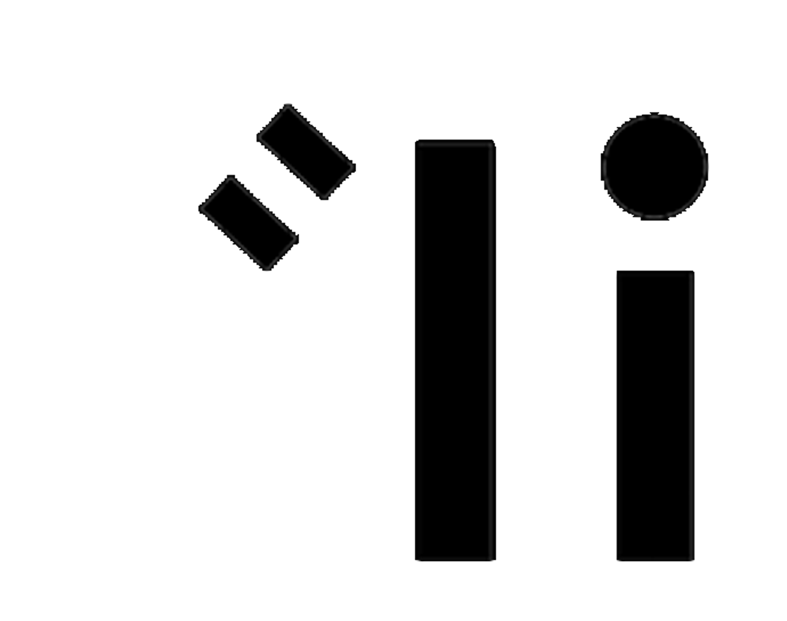
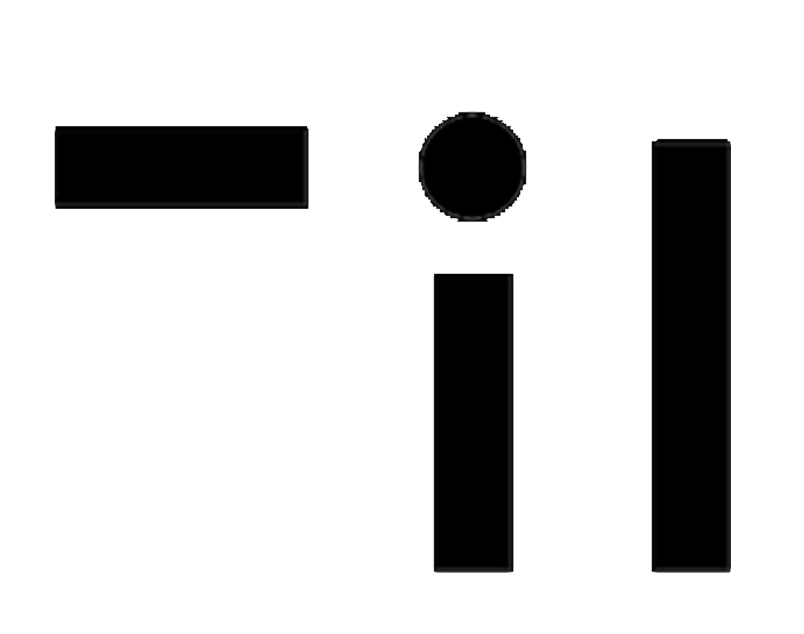
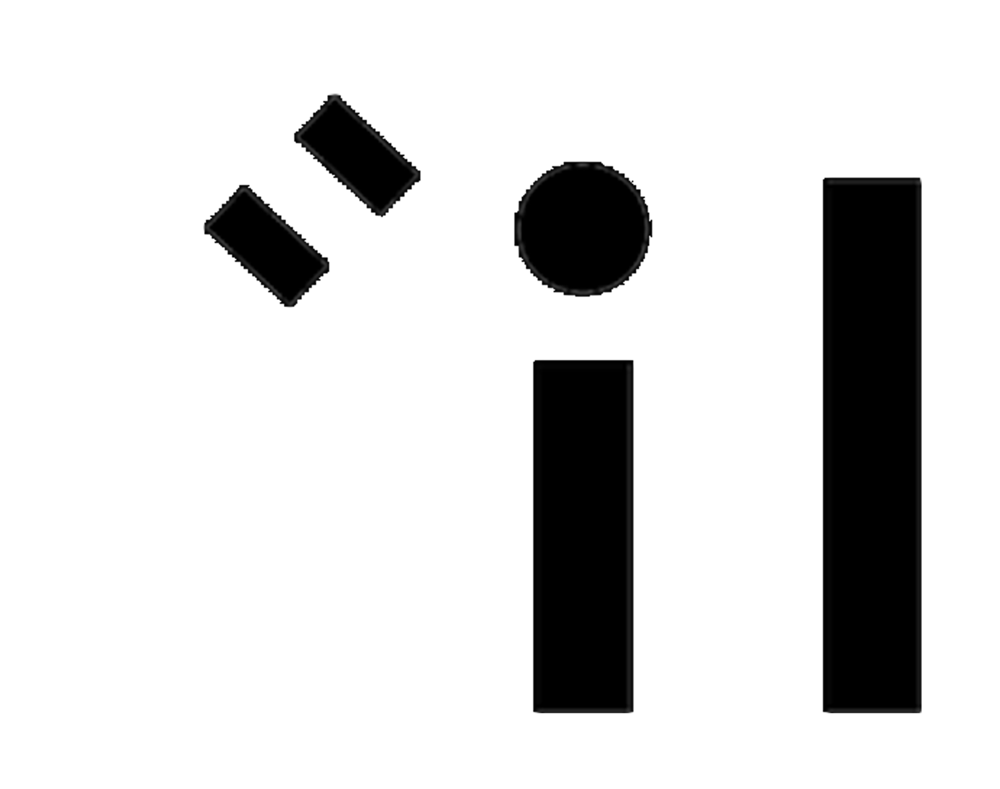
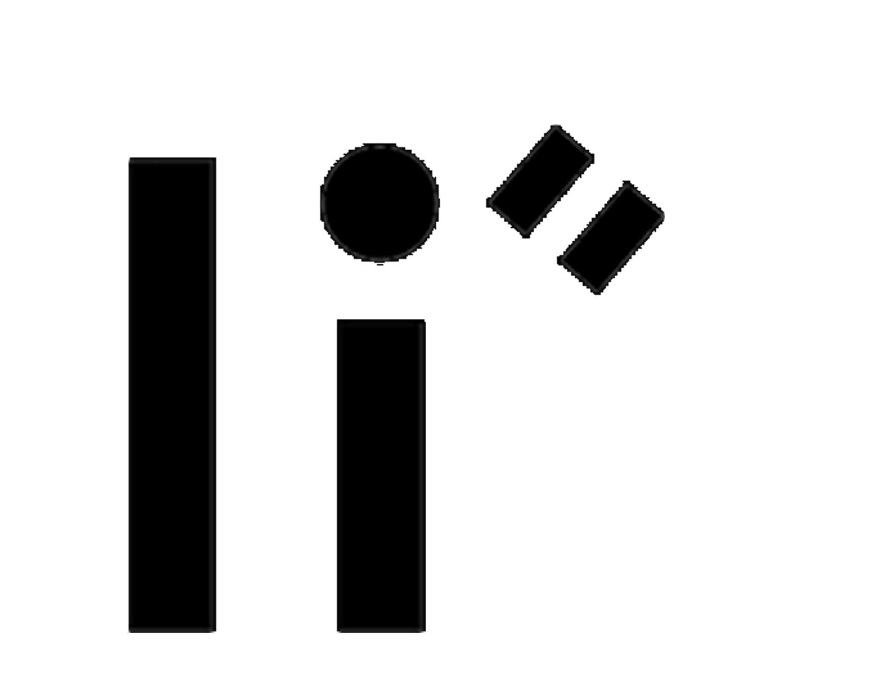

# What are Pentelebets?

## Readme-

## All Functions-







### Algorithms



### Servelets







### Algebra

### Geometry

### Calculus



## Nomenclature of Components-

| **Images-** |  |
| --- | --- | --- | --- | --- | --- | --- |
| Pentelebet 01\_SATELAIDOR | Pentelebet 02\_TESTEDOR   |
| Pentelebet 03\_AERODOR | Pentelebet 04\_COMIDOR |
| Pentelebet 05\_YVESADOR  | Pentelebet 06\_STAPSADOR  |
| Pentelebet 07\_TECHIDOR   | Pentelebet 08\_ARMIDOR   |
| Pentelebet 09\_POSTADOR   | Pentelebet 10\_LABORAIDOR   |
| Pentelebet 11\_ENERIDOR   | Pentelebet 12\_SUPERIDOR   |

## Devices and Appliances-

## Operating in Python/Unix/Linux-

## Notices-

