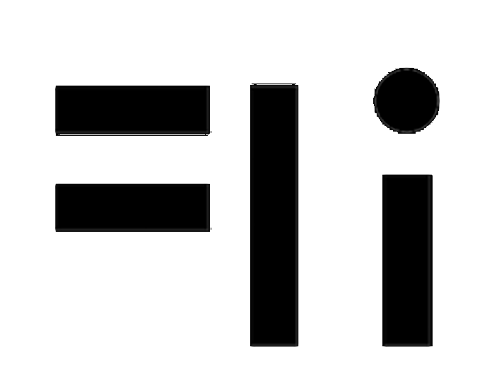

# What are Pentelebets?

## Readme-

### Introduction to Pentelebets- 

The Pentelebets system of programming is used by engineers and scientists to compute large processes and enterprise grade networking of data. Although based upon the QWERTY characters on any keyboard, their usage does not build words and paragraphs, but form a series of number crunching parse processes. 

In embedded Pentelebets; \(languages that have already been encoded in a package or machine\) there are seven types of characters,  

1. Stationary 
2. Transcom 
3. Ancilliary 
4. Packaging 
5. Layering 
6. Environmental 
7. Super-Cluster 

* The first type "stationary" is locked into its host machine and programmed according to ports and slots of its carrier package. 
* The second type ; "transcom" is parsed against the first in a series of inspections to check for matching COI designator tags. 
* The third type; "Ancilliary" is used by codesmiths to maintain security routines or encrypted  data. 
* The fourth type; "packaging" is used to package SoC, FPGA, VHDL and other refactored or repurposed documents. 
* The fifth type; "layering" is used when debugging or building more developed code output. 
* The sixth type; "environmental" is used in buffering designators and or DFN data that is passed by the designated within the Transcom. 
* The seventh type; "super-cluster" is used to archive or compress voluminous data 

## All Functions-







### Algorithms



### Servelets







### Algebra

### Geometry

### Calculus



## Nomenclature of Components-

| **Images-** |  |
| --- | --- | --- | --- | --- | --- | --- |
| Pentelebet 01\_SATELAIDOR | Pentelebet 02\_TESTEDOR   |
| Pentelebet 03\_AERODOR | Pentelebet 04\_COMIDOR |
| Pentelebet 05\_YVESADOR  | Pentelebet 06\_STAPSADOR  |
| Pentelebet 07\_TECHIDOR   | Pentelebet 08\_ARMIDOR   |
| Pentelebet 09\_POSTADOR   | Pentelebet 10\_LABORAIDOR   |
| Pentelebet 11\_ENERIDOR   | Pentelebet 12\_SUPERIDOR   |

## Devices and Appliances-

## Operating in Python/Unix/Linux-

## Notices-

